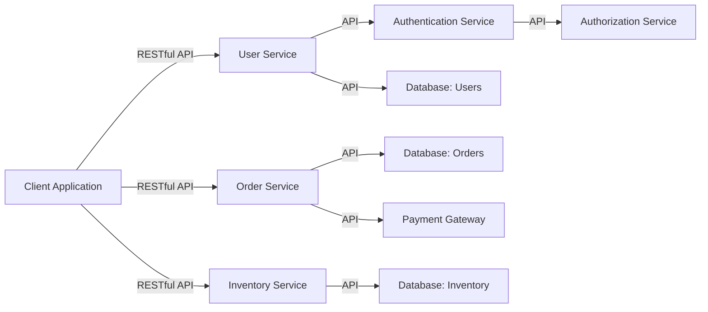
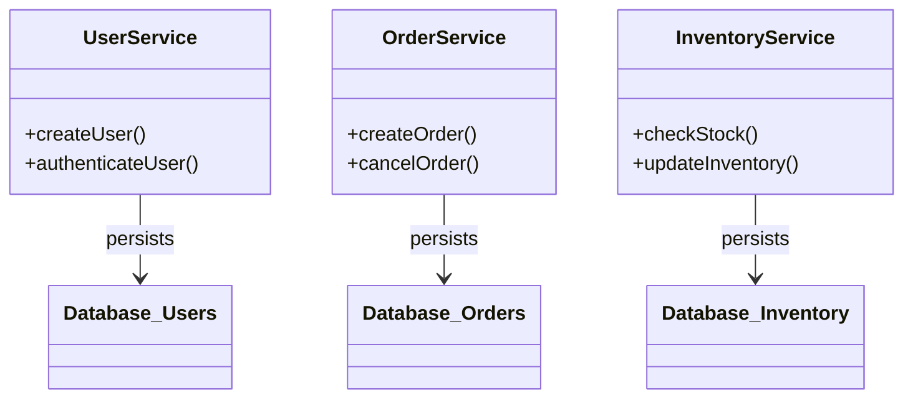
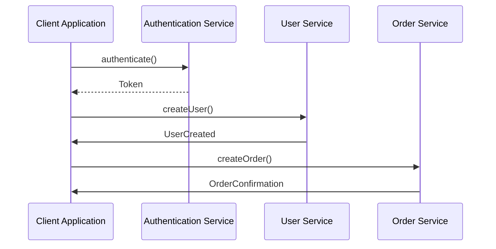
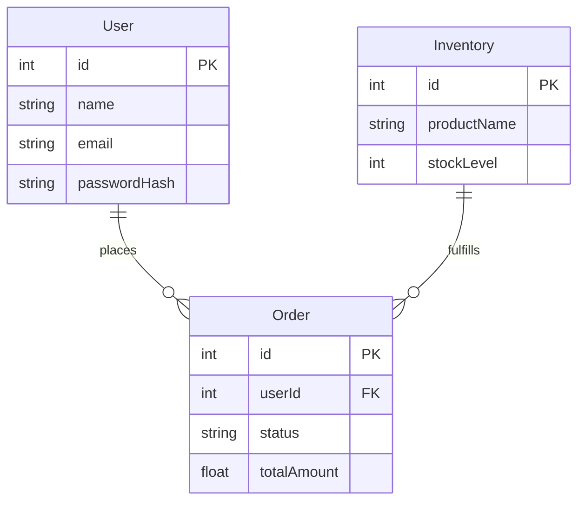

# Solution Design Document for Cloud-Deployed Microservices Application

## HighLevelSystemDesign

The application is designed as a collection of microservices, each encapsulating a specific business domain. The microservices architecture promotes scalability, resilience, and continuous delivery. The system is designed to be cloud-native, leveraging cloud services for optimal performance and reliability.

## UIMocks

N/A - The design document focuses on backend services and their interactions. UI design will be handled by a separate team in accordance with the backend APIs.

## ArchitectureDiagram

## ClassDiagrams

## SequenceFlow

## DataDiagram

## OutOfScope

Frontend development, UI/UX design, and direct code implementation are out of scope for this document. The focus is on backend architecture, API design, and system interactions.

